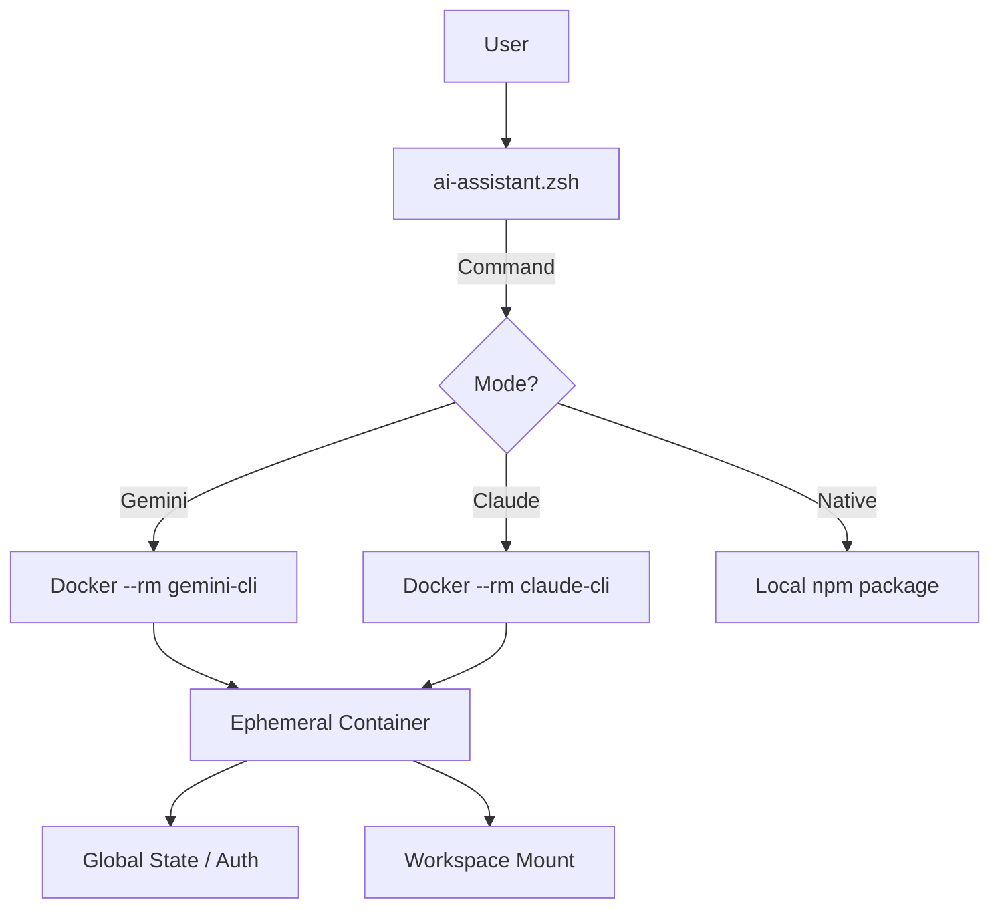

# Session Handoff: Ephemeral Architecture & Universal Rules

**Generated**: 2025-12-15
**Session Goal**: Finalize Ephemeral Architecture and Integrate Trae IDE
**Status**: ✅ **COMPLETED** - v2.1.0 Released

---

## 📊 Executive Summary

### 🎯 Mission Accomplished
Project successfully migrated to a fully **Ephemeral Architecture** (Docker run --rm) with zero persistent state tracking. Added comprehensive support for **Trae IDE** via universal rule synchronization.

### 🏆 Key Achievements
- ✅ **Adaptive Workspace**: Smart mounting (`/workspace`) hides host directory structure.
- ✅ **Universal Rules**: `sync-ai-ide-files.sh` now supports Trae, Claude, and Qoder.
- ✅ **Global Auth**: Unified authentication state in `~/.docker-ai-config/global_state`.
- ✅ **Cleanup**: Removed all legacy persistent container code (`ai-session-manager.sh`).

---

## 🏗️ Architecture Status (v2.1.0)

---

## 🔄 Active Context

### 1. New Features
- **Adaptive Mount**: 
  - Root: `/workspace/<project_name>`
  - Subdir: `/workspace/<subdir>` (hides parent)
- **Trae Integration**: 
  - Rules: `.trae/rules/00-system-manifest.md`
  - Sync: `./scripts/sync-ai-ide-files.sh`

### 2. DevOps State
- **Tag**: `v2.1.0`
- **Branch**: `master`
- **Clean**: No legacy scripts remaining.

---

## 📋 Next Steps (Post-Release)

1. **User Testing**: Verify Trae rules auto-injection in real workflow.
2. **Multi-Session Integration**: Sync changes with `multi-session-ai-ide` repo (if active).
3. **Documentation**: Update `README.md` screenshots to reflect new `/workspace` paths.

---

**Contact**: @RussianLioN
