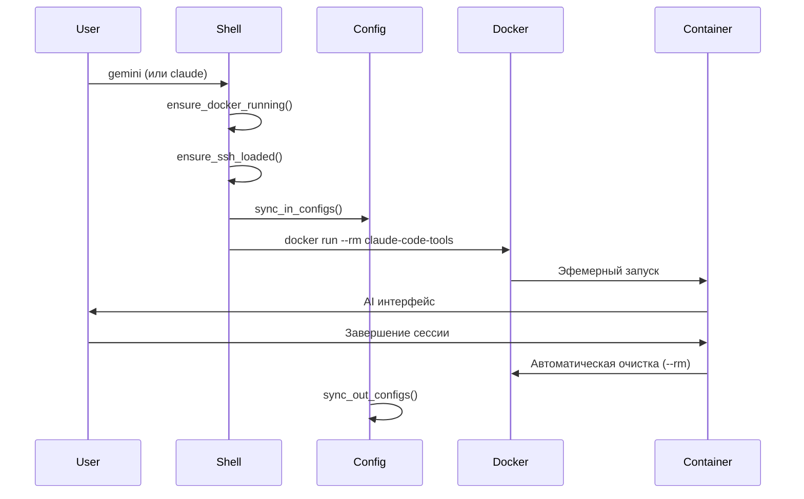
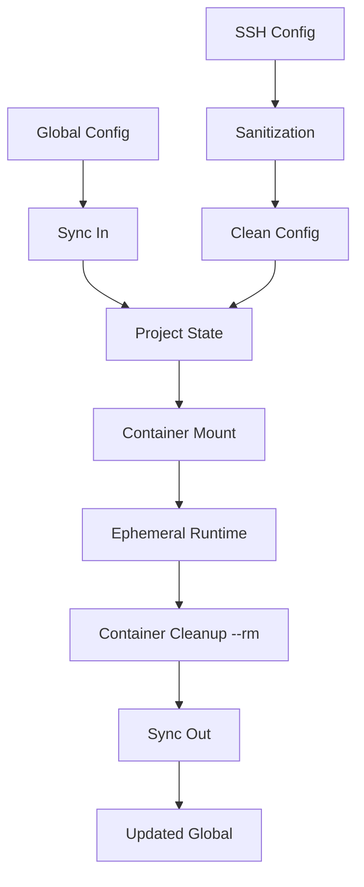

# PROJECT_ARCHITECTURE.md

> **🏗️ Эфемерная Dual AI Environment Architecture**
> *Экспертная архитектура на основе эфемерных контейнеров и проверенных паттернов*

**📍 Navigation**: [← Back to CLAUDE.md](./CLAUDE.md)

## 📋 Overview

Документ описывает переработанную архитектуру Dual AI Assistant Environment на основе **экспертного подхода** с эфемерными контейнерами. В отличие от предыдущей версии с персистентными контейнерами, новая архитектура следует проверенным паттернам из `old-scripts/gemini.zsh`.

## 🎯 Ключевой Архитектурный Принцип

### Эфемерные Контейнеры vs Персистентные

**❌ Старый подход (проблемный)**:
- Персистентные контейнеры с сложным lifecycle management
- State tracking, health monitoring, auto-recovery
- Лимиты контейнеров, проблемы с очисткой
- Сложная синхронизация состояния

**✅ Новый подход (экспертный)**:
- Эфемерные контейнеры с `--rm`
- Запуск и забывание для каждой операции
- Автоматическая очистка
- Простая и надежная модель

## 🏛️ Core Architecture

### High-Level Design

```
┌─────────────────────────────────────────────────────────┐
│                    macOS Host System                    │
├─────────────────────────────────────────────────────────┤
│  ┌─────────────────────────────────────────────────────┐ │
│  │           ai-assistant.zsh (Shell Wrapper)         │ │ │
│  │  ├─ gemini() → Docker --rm (Ephemeral)            │ │ │
│  │  ├─ claude() → Docker --rm (Ephemeral)            │ │ │
│  │  ├─ aic() / cic() (AI Commits)                     │ │ │
│  │  ├─ gexec() (System Commands)                      │ │ │
│  │  └─ ai-session-manager.sh (Legacy Support)        │ │ │
│  └─────────────────────────────────────────────────────┘ │ │
├─────────────────────────────────────────────────────────┤
│                    Docker Runtime                       │
│              (Эфемерные контейнеры --rm)                 │
│  ┌─────────────────────────────────────────────────────┐ │
│  │            claude-code-tools Container              │ │ │
│  │  ├─ entrypoint.sh (Mode Detection)                 │ │ │
│  │  ├─ Node.js Runtime                                │ │ │
│  │  ├─ @google/gemini-cli                             │ │ │
│  │  ├─ @anthropic-ai/claude-cli                       │ │ │
│  │  └─ System Utilities                               │ │ │
│  │         ← Запускается для каждой команды             │ │
│  └─────────────────────────────────────────────────────┘ │
└─────────────────────────────────────────────────────────┘
                           │
                    Volume Mounts (временные)
                           │
┌─────────────────────────────────────────────────────────┐
│                Host File System                        │
│  ├─ Project Directory (/app/<project>)                │
│  ├─ Configuration (~/.docker-ai-config/)              │
│  ├─ Project State (.gemini-state/.ai-state/)         │
│  └─ Session Registry (~/.ai-sessions/)                │
└─────────────────────────────────────────────────────────┘
```

### Component Details

#### 1. Shell Wrapper (ai-assistant.zsh)

**Purpose**: Центральная точка оркестрации AI операций

**Экспертные функции**:
```bash
# Основные AI функции (экспертный паттерн)
gemini()      # Docker run --rm gemini-cli "$@"
claude()      # Docker run --rm claude-cli "$@"

# AI-операции (экспертный паттерн)
aic()         # Docker run --rm gemini-cli commit
cic()         # Docker run --rm claude-cli commit

# Системные операции (экспертный паттерн)
gexec()       # Docker run --rm <command>
ai-mode()     # Переключение AI режимов
```

**Экспертные паттерны**:
- **Ephemeral Pattern**: Каждый вызов = новый контейнер с `--rm`
- **Sync-In/Sync-Out**: Конфигурация синхронизируется при запуске/завершении
- **Zero Trust**: Секреты никогда не покидают хост
- **Smart Detection**: Автоматическое определение project root

#### 2. Container Runtime (Экспертный подход)

**Base Image**: `node:22-alpine`

**Экспертная конфигурация**:
```bash
docker run --rm \
  --network host \
  -e GOOGLE_CLOUD_PROJECT=gemini-cli-auth-478707 \
  -e SSH_AUTH_SOCK=/run/host-services/ssh-auth.sock \
  -v /run/host-services/ssh-auth.sock:/run/host-services/ssh-auth.sock \
  -v "${SSH_KNOWN_HOSTS}":/root/.ssh/known_hosts \
  -v "${SSH_CONFIG_CLEAN}":/root/.ssh/config \
  -v "${GIT_CONFIG}":/root/.gitconfig \
  -v "${GH_CONFIG_DIR}":/root/.config/gh \
  -w "${CONTAINER_WORKDIR}" \
  -v "${TARGET_DIR}":"${CONTAINER_BASE_DIR}" \
  -v "${STATE_DIR}":/root/.gemini \
  claude-code-tools "$@"
```

**Ключевые особенности экспертного подхода**:
- `--rm`: Автоматическая очистка контейнера
- `--network host`: Оптимальная производительность
- **Adaptive Workspace**: Монтирование в `/workspace` для чистых путей
- **Global Auth**: Единое хранилище авторизации для всех проектов
- SSH agent forwarding для аутентификации

#### 3. Configuration Synchronization (Global-First)

**Global State Pattern**:
```bash
# Auth всегда берется из глобального хранилища
export STATE_DIR="$DOCKER_AI_CONFIG_HOME/global_state"
export CLAUDE_STATE_DIR="$STATE_DIR/claude_config"

# Sync-In (до запуска)
cp "$GLOBAL_AUTH" "$STATE_DIR/google_accounts.json"

# Sync-Out (после завершения)
# Claude сам обновляет файлы в примонтированном volume
```

#### 4. Native Mode (Hybrid Architecture)

**Флаг `--native`**:
Позволяет запускать локальную версию Claude (npm) вместо Docker-контейнера.
- **Изоляция**: Использует хостовое окружение (Node.js, авторизация в `~/.claude`).
- **Use Case**: Для задач, требующих прямого доступа к сложным локальным инструментам или когда Docker недоступен.
- **Авторизация**: Раздельная (Docker Auth != Native Auth).

## 🔧 Technical Implementation

### Directory Structure (Обновленная)

```
claude-code-docker-tools/
├── ai-assistant.zsh                # Основной wrapper (экспертный паттерн)
├── Dockerfile                      # Определение контейнера
├── entrypoint.sh                   # Runtime router
├── install.sh                      # Setup script
├── scripts/
│   ├── ai-session-manager.sh       # Legacy support (опционально)
│   └── docker-utils.sh             # Docker utilities
├── old-scripts/
│   └── gemini.zsh                  # Эталонный экспертный код
├── claude-config.json              # Claude configuration
├── CLAUDE.md                       # Central AI instructions
├── AI_SYSTEM_INSTRUCTIONS.md       # Testing principles
├── GIT_WORKFLOWS.md                # Git operations guide
└── docs/
    ├── PROJECT_ARCHITECTURE.md     # Эта архитектура
    └── EPHEMERAL_DESIGN.md         # Детальная документация паттернов
```

### Configuration Management (Экспертный подход)

**Global Configuration** (`~/.docker-gemini-config/` или `~/.docker-ai-config/`):
```
├── google_accounts.json           # OAuth токены
├── settings.json                  # Gemini настройки
├── claude_config.json             # Claude настройки
├── gh_config/                     # GitHub CLI конфигурация
└── global_state/                  # Глобальное состояние для non-git проектов
```

**Project State** (`<project>/.gemini-state/` или `<project>/.ai-state/`):
```
├── google_accounts.json           # Проект-specific аутентификация
├── settings.json                  # Проект-specific настройки
└── ssh_config_clean               # Очищенный SSH конфиг
```

### Security Architecture (Экспертный паттерн)

**Zero Trust Implementation**:
- Секреты никогда не покидают диск хоста
- SSH agent forwarding (не ключи)
- Изолированная среда выполнения контейнера
- Автоматический .gitignore для состояния

**SSH Sanitization (экспертный подход)**:
```bash
# Удаляется из SSH конфига для совместимости с контейнером
grep -vE "UseKeychain|AddKeysToAgent|IdentityFile|IdentitiesOnly" "$SSH_CONFIG_SRC" > "$SSH_CONFIG_CLEAN"
```

## 🔄 Data Flows (Экспертные паттерны)

### AI Session Flow (Эфемерный)



### Configuration Sync Flow (Экспертный)



## 🚀 Performance Considerations (Экспертный подход)

### Container Optimization (Экспертный)

**Runtime Optimization**:
- `--rm`: Автоматическая очистка ресурсов
- `--network host`: Максимальная производительность
- Минимальные volume mounts: только необходимые
- Эфемерность = нет накопления мусора

**Resource Management**:
- Никаких проблем с лимитами контейнеров
- Автоматическая сборка мусора Docker
- Постоянное освобождение ресурсов
- Предсказуемое потребление памяти

### Session Management (Упрощенное)

**Эфемерная архитектура**:
- Никакого health monitoring
- Никакого state tracking
- Никакого auto-recovery
- Простота и надежность

## 🔍 Migration from Persistent to Ephemeral

### Changes Required

**1. ai-assistant.zsh**:
```bash
# Старый подход (удалить)
# docker run -d --name persistent-container

# Новый подход (реализовать)
docker run --rm claude-code-tools "$@"
```

**2. ai-session-manager.sh**:
```bash
# Опционально: legacy support
# Или полное удаление в пользу простых wrapper функций
```

**3. Configuration**:
- Убрать persistent tracking
- Упростить state management
- Использовать экспертные паттерны из old-scripts/gemini.zsh

## 🔮 Future Enhancements (Экспертный подход)

### Planned Features

1. **Enhanced AI Mode Detection**
   - Автоматическое определение типа проекта
   - Контекстные подсказки для разных языков
   - Умные настройки по умолчанию

2. **Configuration Profiles**
   - Профили для разных типов проектов
   - Team-specific конфигурации
   - Environment-specific настройки

3. **Advanced Tool Integration**
   - Интеграция с development tools
   - Custom AI agents
   - Workflow automation

### Scalability Considerations (Экспертный)

**Текущие преимущества**:
- Никаких проблем с масштабированием (эфемерность)
- Простота деплоя
- Предсказуемая производительность
- Минимальные требования к ресурсам

**Будущие улучшения**:
- Batch operations для множественных команд
- Кэширование конфигураций
- Параллельные операции

---

## 🏷️ Architecture Tags

```
Type: EPHEMERAL_ARCHITECTURE
Scope: EXPERT_PATTERN_BASED
Version: 3.0 (Ephemeral Redesign)
Components: 5 (упрощено с 7)
Patterns: 3 (Ephemeral, Sync-In/Out, Zero Trust)
Security_Level: Zero_Trust
Approach: Expert_Proven
Last_Updated: 2025-12-11
Based_On: old-scripts/gemini.zsh expert patterns
```