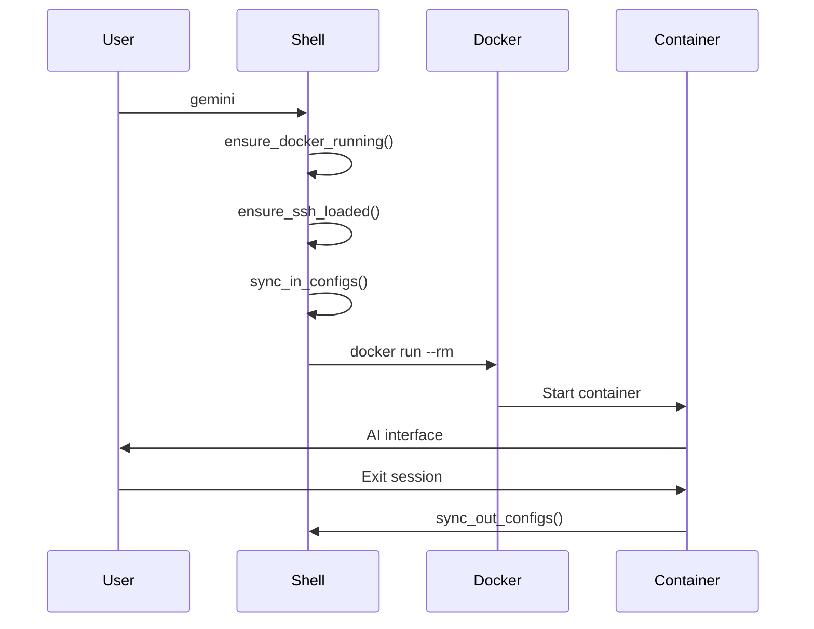
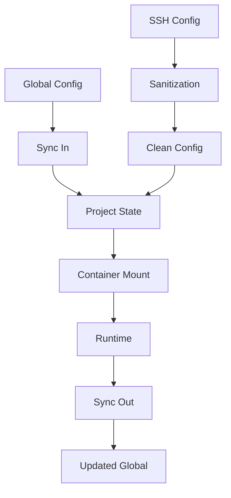

# PROJECT_ARCHITECTURE.md

> **🏗️ Dual AI Environment Architecture**
> *Comprehensive technical architecture and system design*

## 📋 Overview

This document details the complete architecture of the Dual AI Assistant Environment, including system components, data flows, and technical implementation details.

## 🏛️ Core Architecture

### High-Level Design

```
┌─────────────────────────────────────────────────────────┐
│                    macOS Host System                    │
├─────────────────────────────────────────────────────────┤
│  ┌─────────────────────────────────────────────────────┐ │
│  │           ai-assistant.zsh (Shell Wrapper)         │ │ │
│  │  ├─ gemini() → Docker (Gemini Mode)               │ │ │
│  │  ├─ claude() → Docker (Claude Mode)               │ │ │
│  │  ├─ aic() / cic() (AI Commits)                     │ │ │
│  │  └─ gexec() (System Commands)                      │ │ │
│  └─────────────────────────────────────────────────────┘ │ │
├─────────────────────────────────────────────────────────┤
│                    Docker Network                       │
├─────────────────────────────────────────────────────────┤
│  ┌─────────────────────────────────────────────────────┐ │
│  │            claude-code-tools Container              │ │ │
│  │  ├─ entrypoint.sh (Mode Detection)                 │ │ │
│  │  ├─ Node.js Runtime                                │ │ │
│  │  ├─ @google/gemini-cli                             │ │ │
│  │  ├─ @anthropic-ai/claude-cli                       │ │ │
│  │  └─ System Utilities                               │ │ │
│  └─────────────────────────────────────────────────────┘ │
└─────────────────────────────────────────────────────────┘
                           │
                    Volume Mounts
                           │
┌─────────────────────────────────────────────────────────┐
│                Host File System                        │
│  ├─ Project Directory (/app/<project>)                │
│  ├─ Configuration (~/.docker-ai-config/)              │
│  └─ State Management (.ai-state/)                     │
└─────────────────────────────────────────────────────────┘
```

### Component Details

#### 1. Shell Wrapper (ai-assistant.zsh)

**Purpose**: Central orchestration point for all AI interactions

**Key Functions**:
```bash
# Mode Selection
gemini()      # Launches Gemini CLI in Docker
claude()      # Launches Claude Code CLI in Docker

# AI-Powered Operations
aic()         # Gemini AI Commit (DevOps style)
cic()         # Claude AI Commit (SE style)

# System Operations
gexec()       # Execute commands in container
ai-mode()     # Switch between AI modes
```

**Design Patterns**:
- Factory Pattern for mode selection
- Template Method for AI commits
- Proxy Pattern for command execution

#### 2. Container Runtime

**Base Image**: `node:22-alpine`

**Installed Components**:
- Node.js 22.x
- @google/gemini-cli
- @anthropic-ai/claude-cli
- System utilities (git, ssh, gh, curl)

**Configuration**:
```dockerfile
# Environment Variables
ENV CLAUDE_MODEL="claude-3-5-sonnet-20241022"
ENV GEMINI_MODEL="gemini-2.5-pro"
ENV AI_MODE=""  # Detected at runtime
```

#### 3. State Synchronization

**Challenge**: VirtioFS limitations on macOS

**Solution**: Sync In / Sync Out Pattern

```
┌────────────────────┐    Sync In     ┌──────────────────┐
│ ~/.docker-ai-config│ ──────────────→ │ .ai-state/        │
│    (Global)        │                │   (Per Project)   │
└────────────────────┘                └──────────────────┘
         ▲                                    ▲
         │                                    │
    Sync Out                            Runtime Mount
         │                                    │
┌────────────────────┐                ┌──────────────────┐
│ Updated Configs    │ ◀───────────── │ Container Access │
└────────────────────┘                └──────────────────┘
```

## 🔧 Technical Implementation

### Directory Structure

```
claude-code-docker-tools/
├── ai-assistant.zsh          # Main wrapper script
├── Dockerfile                # Container definition
├── entrypoint.sh             # Runtime router
├── install.sh                # Setup script
├── claude-config.json        # Claude configuration
├── CLAUDE.md                 # Central AI instructions
├── AI_SYSTEM_INSTRUCTIONS.md # Testing principles
├── GIT_WORKFLOWS.md          # Git operations guide
└── SESSION_MANAGEMENT_ARCHITECTURE.md  # Multi-instance design
```

### Configuration Management

**Global Configuration** (`~/.docker-ai-config/`):
```
├── env                    # Environment variables
├── settings.json          # Gemini settings
├── claude_config.json     # Claude settings
├── google_accounts.json   # OAuth tokens
└── gh_config/            # GitHub CLI config
```

**Project State** (`<project>/.ai-state/`):
```
├── ssh_config_clean      # Sanitized SSH config
├── google_accounts.json  # Project auth
└── settings.json        # Project settings
```

### Security Architecture

**Zero Trust Implementation**:
- Secrets never leave host disk
- SSH agent forwarding only
- Runtime environment isolation
- Automatic .gitignore for state

**SSH Sanitization**:
```bash
# Removed from SSH config for container compatibility
- UseKeychain
- AddKeysToAgent
- IdentityFile
- IdentitiesOnly
```

## 🔄 Data Flows

### AI Session Flow



### Configuration Sync Flow



## 🚀 Performance Considerations

### Container Optimization

**Build Optimization**:
- Multi-stage builds for minimal image size
- Layer caching for faster rebuilds
- .dockerignore for context reduction

**Runtime Optimization**:
- --network host for optimal performance
- Volume mounts for persistent state
- Resource limits for multi-instance support

### Session Management

**Multi-Instance Architecture**:
- Dynamic port allocation
- Resource monitoring
- Health checking
- Auto-recovery mechanisms

## 🔮 Future Enhancements

### Planned Features

1. **Kubernetes Support**
   - Pod-per-instance deployment
   - Horizontal scaling
   - Advanced scheduling

2. **Plugin System**
   - Hot-pluggable AI providers
   - Custom tool integration
   - Extension ecosystem

3. **Advanced Monitoring**
   - Prometheus metrics
   - Grafana dashboards
   - Alert management

4. **Security Enhancements**
   - mTLS encryption
   - Key management integration
   - Audit logging

### Scalability Considerations

**Current Limitations**:
- Single host deployment
- Manual configuration management
- Limited observability

**Scalability Solutions**:
- Distributed deployment patterns
- Configuration as Code
- Centralized monitoring

---

## 🏷️ Architecture Tags

```
Type: TECHNICAL_ARCHITECTURE
Scope: SYSTEM_DESIGN
Version: 2.0
Components: 7
Patterns: 4
Security_Level: Zero_Trust
Last_Updated: 2025-12-11
```