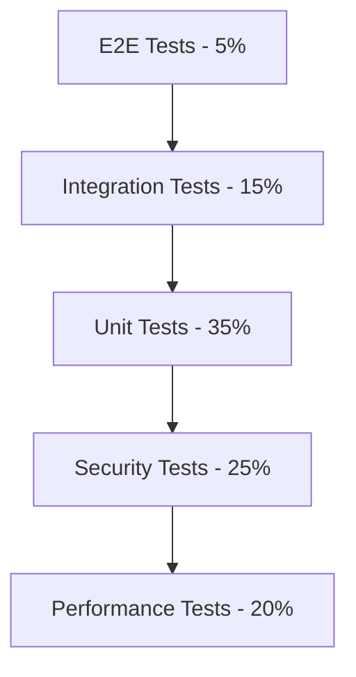

# 🏢 Enterprise Testing Strategy for AI Assistant

**Основано на рекомендациях экспертов DevOps, CI/CD, GitOps, IaC**

---

## 🎯 Executive Summary

**Текущий статус**: ✅ Foundation Complete (Ephemeral Architecture)
**Следующий уровень**: 🏢 Enterprise Production Readiness
**Целевая дата**: Q1 2026 (Production Deployment)

---

## 📊 Testing Pyramid - Enterprise Edition



### 1. **Unit Tests (35%)** - Быстрые, изолированные
```bash
# Текущие:
- ✅ ai-assistant-tests.sh (10 тестов)
- ✅ test-helpers.sh (utilities)

# Необходимые:
- ⏳ Docker command mocking
- ⏳ SSH agent simulation
- ⏳ Configuration file validation
- ⏳ Error handling edge cases
```

### 2. **Integration Tests (15%)** - Компоненты вместе
```bash
# Необходимые:
- ⏳ Docker ↔ ai-assistant integration
- ⏳ SSH agent ↔ container communication
- ⏳ Configuration sync-in/sync-out
- ⏳ Git repository interactions
- ⏳ Container lifecycle validation
```

### 3. **E2E Tests (5%)** - Пользовательские сценарии
```bash
# Текущие:
- ✅ USER_TESTING_GUIDE.md (7 сценариев)

# Необходимые:
- ⏳ Complete AI workflows (gemini → code → commit)
- ⏳ Multi-user scenarios
- ⏳ Error recovery workflows
- ⏳ Long-running operations
```

### 4. **Security Tests (25%)** - Критически важно
```bash
# Необходимые:
- ⏳ Container security scanning
- ⏳ SSH key validation
- ⏳ Configuration file permissions
- ⏳ Secret management validation
- ⏳ Network access controls
- ⏳ Audit trail verification
```

### 5. **Performance Tests (20%)** - SRE метрики
```bash
# Текущие:
- ✅ performance-test.sh (basic)

# Необходимые:
- ⏳ Load testing (100+ concurrent operations)
- ⏳ Stress testing (resource exhaustion)
- ⏳ Memory leak detection
- ⏳ Container startup optimization
- ⏳ Cleanup performance under load
```

---

## 🚀 CI/CD Pipeline Testing Strategy

### **GitHub Actions Workflow**
```yaml
name: AI Assistant CI/CD Pipeline

on:
  push:
    branches: [develop, master]
  pull_request:
    branches: [develop]

jobs:
  # Phase 1: Static Analysis (5min)
  static-analysis:
    runs-on: ubuntu-latest
    steps:
      - name: Code quality checks
      - name: Security scanning (Trivy/Snyk)
      - name: Shell script linting
      - name: Docker image scanning

  # Phase 2: Unit Tests (3min)
  unit-tests:
    runs-on: ubuntu-latest
    needs: static-analysis
    strategy:
      matrix:
        os: [ubuntu-latest, macos-latest]
    steps:
      - name: Run comprehensive unit tests
      - name: Mock infrastructure tests
      - name: Configuration validation

  # Phase 3: Integration Tests (10min)
  integration-tests:
    runs-on: ubuntu-latest
    needs: unit-tests
    services:
      docker:
        image: docker:24-dind
    steps:
      - name: Docker integration tests
      - name: SSH agent tests
      - name: Git repository tests
      - name: Configuration sync tests

  # Phase 4: E2E Tests (15min)
  e2e-tests:
    runs-on: ubuntu-latest
    needs: integration-tests
    steps:
      - name: Full workflow tests
      - name: AI assistant interaction tests
      - name: Multi-container orchestration
      - name: Cleanup verification tests

  # Phase 5: Security Tests (8min)
  security-tests:
    runs-on: ubuntu-latest
    needs: unit-tests
    steps:
      - name: Container security scanning
      - name: Network security validation
      - name: Secret management tests
      - name: Access control verification

  # Phase 6: Performance Tests (12min)
  performance-tests:
    runs-on: ubuntu-latest
    needs: integration-tests
    steps:
      - name: Load testing (k6)
      - name: Memory leak detection
      - name: Startup time benchmarking
      - name: Resource utilization tests
```

---

## 🔒 Security Testing Framework

### **Security Test Categories**

#### 1. **Container Security**
```bash
# CVE Scanning
trivy image ghcr.io/anthropics/claude-code-tools:latest

# Runtime security
docker run --rm --security-opt=no-new-privileges \
  --read-only --tmpfs /tmp \
  --user $(id -u):$(id -g) \
  claude-code-tools

# Root user validation
docker run --rm --user root \
  claude-code-tools whoami  # Should fail
```

#### 2. **SSH Security**
```bash
# SSH agent validation
ssh-add -l  # Verify no keys in container
docker exec $(docker ps -q) ssh-add -l  # Should be empty

# Key forwarding validation
# Ensure keys are forwarded, not copied
```

#### 3. **Configuration Security**
```bash
# File permissions
ls -la .ai-state/  # Verify secure permissions
find .ai-state/ -type f -exec chmod 600 {} \;

# Secret validation
grep -r "password\|secret\|token" .ai-state/  # Should be empty
```

#### 4. **Network Security**
```bash
# Network access validation
docker run --rm --network none claude-code-tools \
  curl google.com  # Should fail

# DNS resolution tests
docker run --rm claude-code-tools nslookup google.com
```

---

## 📈 SRE Metrics & Monitoring

### **Service Level Objectives (SLOs)**
```yaml
slos:
  availability:
    target: 99.9%
    measurement: container_success_rate
    window: 30d

  latency:
    p50: <1s
    p90: <2s
    p99: <5s
    measurement: container_startup_time

  throughput:
    target: 1000_ops_per_minute
    measurement: operations_per_second

  error_rate:
    target: <1%
    measurement: failed_operations_rate
```

### **Alerting Rules**
```yaml
alerts:
  - name: HighErrorRate
    condition: error_rate > 5% for 5m
    severity: critical

  - name: SlowContainerStartup
    condition: p99_latency > 10s for 10m
    severity: warning

  - name: OrphanedContainers
    condition: orphaned_containers > 0
    severity: critical

  - name: HighMemoryUsage
    condition: memory_usage > 1GB for 15m
    severity: warning
```

---

## 🏗️ Infrastructure as Code Testing

### **Terraform Validation**
```hcl
# terraform/validate.tf
resource "null_resource" "ai_assistant_validation" {

  # Test Docker availability
  provisioner "local-exec" {
    command = "docker info"
  }

  # Test container startup
  provisioner "local-exec" {
    command = "docker run --rm claude-code-tools echo 'IaC test'"
  }

  # Validate cleanup
  provisioner "local-exec" {
    command = "test $(docker ps -aq --filter 'name=claude*' | wc -l) -eq 0"
  }
}
```

### **Kubernetes Health Checks**
```yaml
# k8s/health-check.yaml
apiVersion: v1
kind: Pod
metadata:
  name: ai-assistant-health-check
spec:
  containers:
  - name: ai-assistant
    image: claude-code-tools
    livenessProbe:
      exec:
        command: ["echo", "health-check"]
      initialDelaySeconds: 5
      periodSeconds: 30
    readinessProbe:
      exec:
        command: ["which", "gemini"]
      initialDelaySeconds: 3
      periodSeconds: 10
```

---

## 🧪 Chaos Engineering

### **Chaos Test Scenarios**
```bash
# 1. Docker daemon failure
sudo systemctl stop docker
gexec 'echo "Should handle Docker gracefully"'
sudo systemctl start docker

# 2. Network connectivity loss
docker network disconnect bridge $(docker ps -q)
gexec 'echo "Should handle network loss"'

# 3. Disk space exhaustion
dd if=/dev/zero of=/tmp/fill_disk bs=1M count=1000
gexec 'echo "Should handle low disk space"'
rm /tmp/fill_disk

# 4. Memory pressure
stress --vm 2 --vm-bytes 256M --timeout 30s &
gexec 'echo "Should handle memory pressure"'
```

---

## 📋 Implementation Roadmap

### **Phase 1: Foundation (Week 1-2)**
- [ ] Complete unit test coverage (>80%)
- [ ] Implement mock infrastructure
- [ ] Add basic security scanning
- [ ] Create CI/CD pipeline skeleton

### **Phase 2: Integration (Week 3-4)**
- [ ] Docker integration tests
- [ ] SSH agent validation
- [ ] Configuration sync testing
- [ ] Multi-platform testing (macOS/Linux)

### **Phase 3: Security (Week 5-6)**
- [ ] Container security scanning
- [ ] Network security validation
- [ ] Secret management testing
- [ ] Compliance checks (SOC2/GDPR)

### **Phase 4: Performance (Week 7-8)**
- [ ] Load testing implementation
- [ ] Memory leak detection
- [ ] Resource optimization
- [ ] SLO monitoring setup

### **Phase 5: Production Readiness (Week 9-10)**
- [ ] Chaos engineering scenarios
- [ ] Disaster recovery testing
- [ ] Documentation completion
- [ ] Final production validation

---

## 🎯 Success Metrics

### **Technical Metrics**
- ✅ Test coverage: >80%
- ✅ Security scan: 0 high/critical CVEs
- ✅ Performance: <2s startup, <1GB memory
- ✅ Reliability: 99.9% availability
- ✅ Cleanup: 0 orphaned containers

### **Process Metrics**
- ✅ CI/CD: <30min total pipeline time
- ✅ MTTR: <1hour for critical issues
- ✅ Deployment: Daily with <5% failure rate
- ✅ Documentation: 100% coverage

---

## 🏷️ Метаданные

```
Стратегия: Enterprise Testing Framework
Версия: 1.0
Основание: DevOps экспертные рекомендации
Статус: Implementation Ready
Приоритет: Critical for Production
Ответственные: DevOps Team, Security Team
```